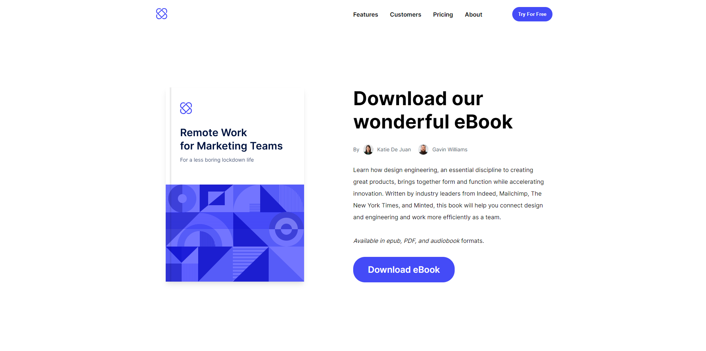

# Ebook Landing Page

A landing page mock implementation for an ebook, built with HTML, CSS, and JavaScript. The page includes a modal behavior to capture user information.

## Modal Behavior Implementation

This repository demonstrates the implementation of a modal behavior in JavaScript. The modal behavior includes opening a popup modal with a form to capture user information, checking for empty fields, and updating the button text and appearance upon successful submission.

### Modal Behavior Features

- When the "Download eBook" button is pressed, a popup modal is displayed with a form to capture user information.
- The form includes fields for:
  - First name
  - Last name
  - Email address
- The form checks for empty fields. If any field is empty, the form does not submit.
- Upon successful submission of all fields:
  - The submit button text changes to "Sent"
  - The submit button color changes to green
  - The submit button is disabled

## Usage

1. Clone this repository to your local machine.
2. Open the `index.html` file in a web browser.
3. Click the "Download eBook" button to open the modal and interact with the form.
